Time Series in R
================

#First we will need some packages

```r
#knitr to make this doc
library(knitr)
#For an example dataset and well BVAR
library(MSBVAR)
```

```
## KernSmooth 2.23 loaded
## Copyright M. P. Wand 1997-2009
## ##
## ## MSBVAR Package v.0.9-1
## ## Build date:  Thu Oct  2 16:28:42 2014 
## ## Copyright (C) 2005-2014, Patrick T. Brandt
## ## Written by Patrick T. Brandt
## ##
## ## Support provided by the U.S. National Science Foundation
## ## (Grants SES-0351179, SES-0351205, SES-0540816, and SES-0921051)
## ##
```

```r
#For pipes
library(magrittr)
```

#Working with Time Series Data

If you have a few values, ***R***, does not know it is a time series, if you do not tell it so.


```r
nots <- c(2,6,4,7,1,9,10,7,6,3)
plot(nots)
```

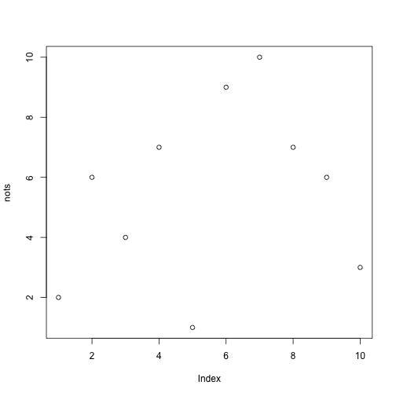 
So, use the ts function:


```r
yests<-ts(nots, start=1, frequency=1)
plot(yests)
```

 

`start` tells it when to start, `frequency` says how many observations per time chunk you have. For example, if you had annual data that started in 1950, you would set start=1, and frequency=1. If you had quarterly data that started in the second quarter of 1960, you would set start=c(1960,1), and frequency=4. Think about what this says? Note that `time` just prints out observations you have based on `ts`.


```r
newts <- ts(nots, start=c(2013,9), frequency=12)
time(newts)
```

```
##       Jan  Feb  Mar  Apr  May  Jun Jul Aug  Sep  Oct  Nov  Dec
## 2013                                       2014 2014 2014 2014
## 2014 2014 2014 2014 2014 2014 2014
```

If you want a dataframe with more than one time series, for example, `x` and `B.x` or `D.x`, use `ts.intersect`, it aligns the dates smartly, and trims missings. `dframe=TRUE` takes away the time  stamp and frequency meta-data but makes it easier to work with when integrating with other dataframes. Can also use `cbind()`


```r
newts
```

```
##      Jan Feb Mar Apr May Jun Jul Aug Sep Oct Nov Dec
## 2013                                   2   6   4   7
## 2014   1   9  10   7   6   3
```

```r
newtsdf <- ts.intersect(newts, lagnewts=lag(newts,k=-1), diffnewts=diff(newts), dframe=TRUE)
newtsdf
```

```
##   newts lagnewts diffnewts
## 1     6        2         4
## 2     4        6        -2
## 3     7        4         3
## 4     1        7        -6
## 5     9        1         8
## 6    10        9         1
## 7     7       10        -3
## 8     6        7        -1
## 9     3        6        -3
```

```r
cbindts<-cbind(newts,lag(newts,k=-1),diff(newts))
cbindts
```

```
##          newts lag(newts, k = -1) diff(newts)
## Sep 2013     2                 NA          NA
## Oct 2013     6                  2           4
## Nov 2013     4                  6          -2
## Dec 2013     7                  4           3
## Jan 2014     1                  7          -6
## Feb 2014     9                  1           8
## Mar 2014    10                  9           1
## Apr 2014     7                 10          -3
## May 2014     6                  7          -1
## Jun 2014     3                  6          -3
## Jul 2014    NA                  3          NA
```

Note the `k=-1`, if you do this (see next code chunk), you might not be getting what you want:

```r
badtsdf <- ts.intersect(newts, lagnewts=lag(newts), diffnewts=diff(newts))
badtsdf
```

```
##          newts lagnewts diffnewts
## Oct 2013     6        4         4
## Nov 2013     4        7        -2
## Dec 2013     7        1         3
## Jan 2014     1        9        -6
## Feb 2014     9       10         8
## Mar 2014    10        7         1
## Apr 2014     7        6        -3
## May 2014     6        3        -1
```

Note that the package ***dplyr***, which is terrific, has its own `lag()` function that reverses this (k=1, is n=-1). This code here is for the base-install included ***stats*** package. 

For differencing twice, you do not do `diff(newts, 2)`, but instead `diff(diff(newts))` or `diff(newts, order=2`.


```r
difftsdf<-ts.intersect(newts, diff1ts=diff(newts), difflag2ts=diff(newts,lag=2),diffdiffts=diff(diff(newts)))
difftsdf
```

```
##          newts diff1ts difflag2ts diffdiffts
## Nov 2013     4      -2          2         -6
## Dec 2013     7       3          1          5
## Jan 2014     1      -6         -3         -9
## Feb 2014     9       8          2         14
## Mar 2014    10       1          9         -7
## Apr 2014     7      -3         -2         -4
## May 2014     6      -1         -4          2
## Jun 2014     3      -3         -4         -2
```

If you only want a subset of the time periods you have, use `window()`


```r
smallerts <- window(newts, start=c(2013,11), end=c(2014,3))
smallerts
```

```
##      Jan Feb Mar Apr May Jun Jul Aug Sep Oct Nov Dec
## 2013                                           4   7
## 2014   1   9  10
```

#Diagnosing Time Series (Simulated Examples)

Set a random seed so we can generate the same data


```r
set.seed(123456789)
```

We can simulate an AR(1) with $\phi=.9$


```r
x <- arima.sim(list(order=c(1,0,0), ar=.9),n=500)
plot.ts(x, main=expression(paste("AR(1), " , phi, "=.9")))
abline(h=0)
```

 

Now lets look at an ACF


```r
acf(x)
```

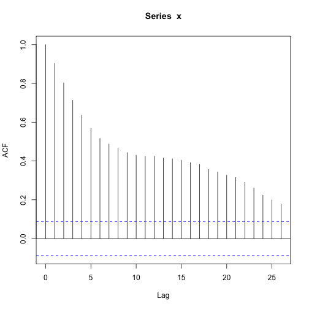 

and the pacf


```r
pacf(x)
```

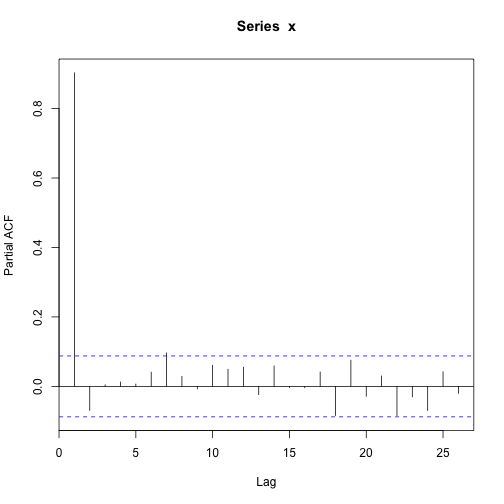 


```r
arima(x,order=c(1,0,0))
```

```
## 
## Call:
## arima(x = x, order = c(1, 0, 0))
## 
## Coefficients:
##         ar1  intercept
##       0.905      0.713
## s.e.  0.019      0.465
## 
## sigma^2 estimated as 1.01:  log likelihood = -713.1,  aic = 1432
```

What about OLS?


```r
x.df<-ts.intersect(x, lag1x=lag(x,-1), dframe=TRUE)
summary(lm(x~lag1x, data=x.df))
```

```
## 
## Call:
## lm(formula = x ~ lag1x, data = x.df)
## 
## Residuals:
##    Min     1Q Median     3Q    Max 
## -3.275 -0.724 -0.007  0.725  3.390 
## 
## Coefficients:
##             Estimate Std. Error t value Pr(>|t|)    
## (Intercept)   0.0776     0.0477    1.63      0.1    
## lag1x         0.9047     0.0191   47.40   <2e-16 ***
## ---
## Signif. codes:  0 '***' 0.001 '**' 0.01 '*' 0.05 '.' 0.1 ' ' 1
## 
## Residual standard error: 1.01 on 497 degrees of freedom
## Multiple R-squared:  0.819,	Adjusted R-squared:  0.819 
## F-statistic: 2.25e+03 on 1 and 497 DF,  p-value: <2e-16
```
Notice that the intercepts are different. Arima estimates the mean (which is then subtracted from both yt and yt-1), while OLS is estimating the intercept. You can get the OLS intercept from the arima output by taking the mean times (1-phi), which in this case is .713*.905=.78 


We can simulate an MA(1) with $\theta=-.9$


```r
x <- arima.sim(list(order=c(0,0,1), ma=-.9),n=500)
plot.ts(x, main=expression(paste("MA(1), " , theta, "=-.9")))
abline(h=0)
```

 

Now lets look at an ACF


```r
acf(x)
```

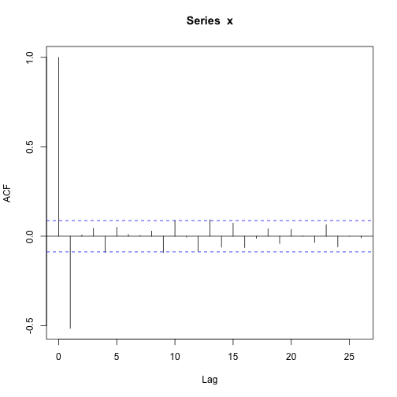 

and the pacf


```r
pacf(x)
```

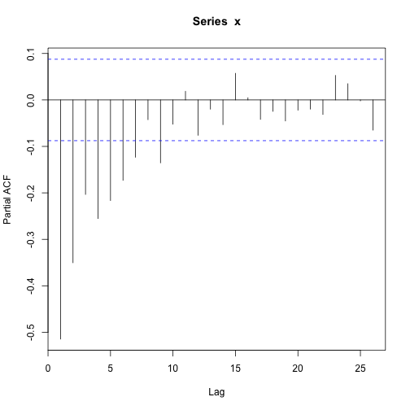 
Can estimate an ARIMA model


```r
arima(x, order=c(0,0,1))
```

```
## 
## Call:
## arima(x = x, order = c(0, 0, 1))
## 
## Coefficients:
##          ma1  intercept
##       -0.920     -0.002
## s.e.   0.017      0.004
## 
## sigma^2 estimated as 1.04:  log likelihood = -720.7,  aic = 1447
```


We can simulate an MA(1) with $\theta= +.9$


```r
x <- arima.sim(list(order=c(0,0,1), ma= .9),n=500)
plot.ts(x, main=expression(paste("MA(1), " , theta, "= +.9")))
abline(h=0)
```

 

Now lets look at an ACF


```r
acf(x)
```

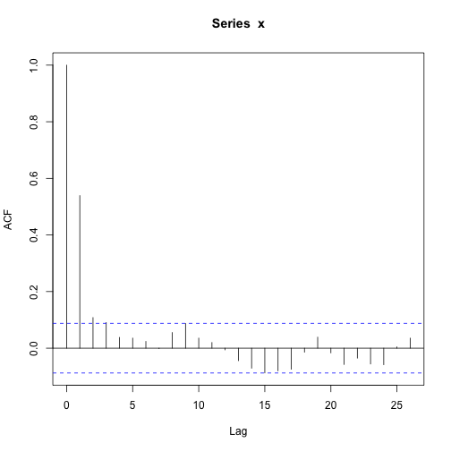 

and the pacf


```r
pacf(x)
```

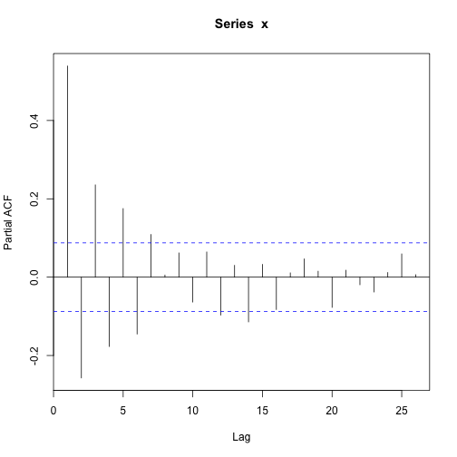 


```r
arima(x, order=c(0,0,1))
```

```
## 
## Call:
## arima(x = x, order = c(0, 0, 1))
## 
## Coefficients:
##         ma1  intercept
##       0.874     -0.079
## s.e.  0.023      0.083
## 
## sigma^2 estimated as 0.995:  log likelihood = -708.9,  aic = 1424
```


Now lets try something nonstationary


```r
x <- rnorm(500) %>% cumsum()
plot.ts(x, main=expression(paste("Randow Walk, " , phi, "= 1")))
abline(h=0)
```

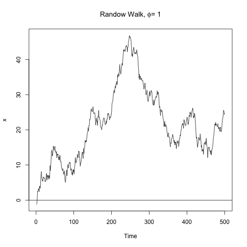 

Now lets look at an ACF


```r
acf(x)
```

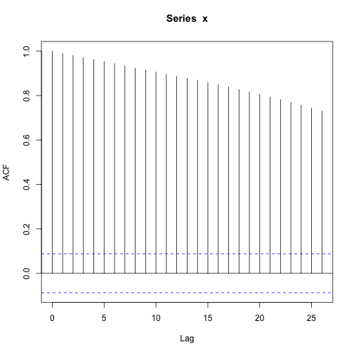 

and the pacf


```r
pacf(x)
```

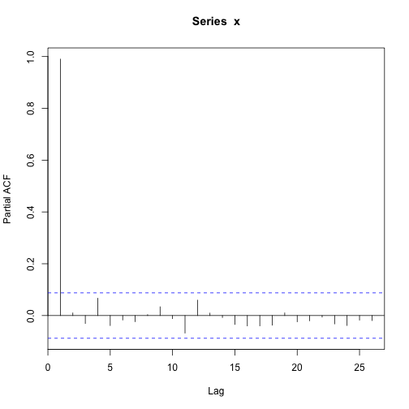 

Then look at difference $\delta y$


```r
plot.ts(diff(x), main=expression(paste("Randow Walk (differenced), " , phi, "= 1")))
abline(h=0)
```

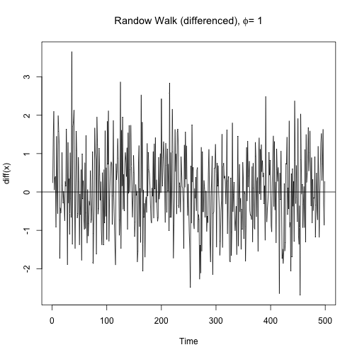 

Now lets look at an ACF


```r
acf(diff(x))
```

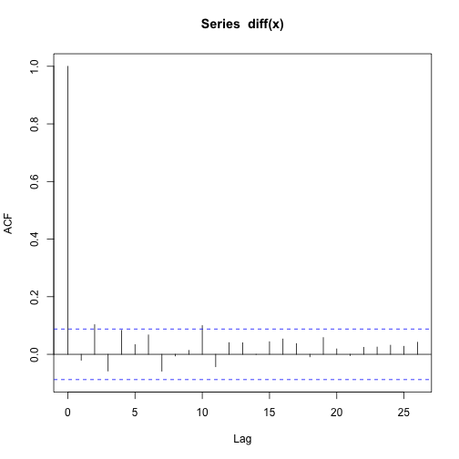 

and the pacf


```r
pacf(diff(x))
```

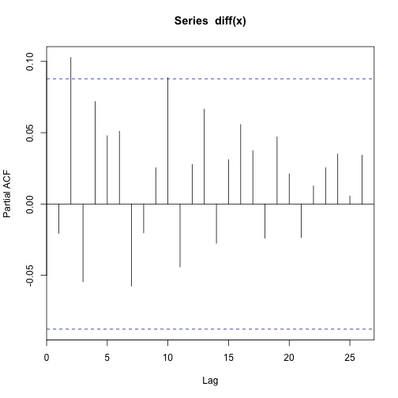 

You can get the Box-Ljung statistics with


```r
Box.test (diff(x), lag = 1, type = "Ljung")
```

```
## 
## 	Box-Ljung test
## 
## data:  diff(x)
## X-squared = 0.2127, df = 1, p-value = 0.6446
```

```r
Box.test (diff(x), lag = 2, type = "Ljung")
```

```
## 
## 	Box-Ljung test
## 
## data:  diff(x)
## X-squared = 5.561, df = 2, p-value = 0.06201
```

```r
Box.test (diff(x), lag = 3, type = "Ljung")
```

```
## 
## 	Box-Ljung test
## 
## data:  diff(x)
## X-squared = 7.255, df = 3, p-value = 0.0642
```

```r
Box.test (diff(x), lag = 4, type = "Ljung")
```

```
## 
## 	Box-Ljung test
## 
## data:  diff(x)
## X-squared = 10.75, df = 4, p-value = 0.02949
```

```r
Box.test (diff(x), lag = 5, type = "Ljung")
```

```
## 
## 	Box-Ljung test
## 
## data:  diff(x)
## X-squared = 11.33, df = 5, p-value = 0.04523
```


#Diagnosing Time Series (The Real World, East Lansing)

Now lets look at real world data. The ***MSBVAR*** package has data on conflict scores for Israel and Palestinian Authority, as well as other variables. Because we loaded the backage already, we can extract the data from the package with: 


```r
data(BCFdata)
```
The main time series are now in an object called `Y`:


```r
Y[1:10,]
```

```
##           I2P     P2I  JPI
##  [1,] -2.5806 -0.8364 63.3
##  [2,] -2.8823 -1.9726 66.3
##  [3,] -1.7428 -0.4788 59.7
##  [4,] -0.3978 -1.5743 63.3
##  [5,] -0.9772 -1.7973 63.8
##  [6,] -0.9365 -0.3805 60.5
##  [7,] -1.8534 -0.5937 63.1
##  [8,] -2.1137 -2.0378 63.6
##  [9,] -2.7032 -1.0073 62.5
## [10,] -1.2074 -0.5394 59.5
```

```r
is.ts(Y)
```

```
## [1] TRUE
```

```r
time(Y)
```

```
##       Jan  Feb  Mar  Apr  May  Jun  Jul  Aug  Sep  Oct  Nov  Dec
## 1996                1996 1996 1996 1996 1997 1997 1997 1997 1997
## 1997 1997 1997 1997 1997 1997 1997 1998 1998 1998 1998 1998 1998
## 1998 1998 1998 1998 1998 1998 1998 1998 1999 1999 1999 1999 1999
## 1999 1999 1999 1999 1999 1999 1999 2000 2000 2000 2000 2000 2000
## 2000 2000 2000 2000 2000 2000 2000 2000 2001 2001 2001 2001 2001
## 2001 2001 2001 2001 2001 2001 2001 2002 2002 2002 2002 2002 2002
## 2002 2002 2002 2002 2002 2002 2002 2002 2003 2003 2003 2003 2003
## 2003 2003 2003 2003 2003 2003 2003 2004 2004 2004 2004 2004 2004
## 2004 2004 2004 2004 2004 2004 2004 2004 2005 2005 2005 2005 2005
## 2005 2005 2005 2005 2005 2005 2005 2006 2006 2006 2006 2006 2006
```

We seet that this is monthly data that starts in April 1996, and ends in Dec. 2005. We have net behavior (cooperation-conflict) sent from Israel to Palestinian Authority (I2P, lower values, more conflict), Palestinian Authority to Israel (P2I, lower values, more conflict), as well as a public opinion series collected in Israel (JPI, higher values, more support for peace settlement negotiations). We have 117 observations for each series.

We can plot the series


```r
plot(Y)
```

 

Lets look at potential change in the series in Oct. 2000 (Battle of Jenin). Need a dummy variable equal to zero from Apr. 1996 to Sept. 2000, and then 1, from Oct. 2000 to Dec. 2005.


```r
ts1 <- ts(0, start=c(1996,4), end=c(2000,9),frequency=12)
ts2 <- ts(1, start=c(2000,10), end=c(2005,12), frequency=12)
PostJenin <- ts(c(ts1,ts2), start=c(1996,4), end=c(2005,12), frequency=12)
PostJenin
```

```
##      Jan Feb Mar Apr May Jun Jul Aug Sep Oct Nov Dec
## 1996               0   0   0   0   0   0   0   0   0
## 1997   0   0   0   0   0   0   0   0   0   0   0   0
## 1998   0   0   0   0   0   0   0   0   0   0   0   0
## 1999   0   0   0   0   0   0   0   0   0   0   0   0
## 2000   0   0   0   0   0   0   0   0   0   1   1   1
## 2001   1   1   1   1   1   1   1   1   1   1   1   1
## 2002   1   1   1   1   1   1   1   1   1   1   1   1
## 2003   1   1   1   1   1   1   1   1   1   1   1   1
## 2004   1   1   1   1   1   1   1   1   1   1   1   1
## 2005   1   1   1   1   1   1   1   1   1   1   1   1
```
Now look at that on plot of `P2I`.


```r
plot(Y[,"P2I"])
abline(v=c(2000,10), col="red")
```

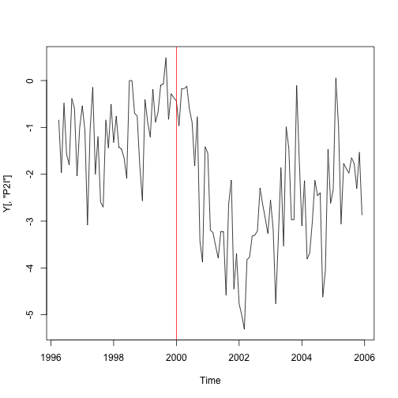 

Diagnose the series, before the intervention we are interested in looking at.


```r
par(mfrow=c(2,1))
Y[,"P2I"] %>% window(end=c(2000,9)) %>% function(x) {
	acf(x, main="P2I ACF") 
	pacf(x, main="P2I PACF")
	}
```

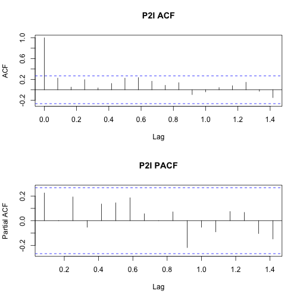 

We can use OLS to estimate model with Post Jenin permanent intervention and possible gradual change. First create dataset we will use.


```r
data2 <- ts.intersect(P2I=Y[,"P2I"], LagP2I=lag(Y[,"P2I"], k=-1), PostJenin)
head(data2)
```

```
##          P2I  LagP2I PostJenin
## [1,] -1.9726 -0.8364         0
## [2,] -0.4788 -1.9726         0
## [3,] -1.5743 -0.4788         0
## [4,] -1.7973 -1.5743         0
## [5,] -0.3805 -1.7973         0
## [6,] -0.5937 -0.3805         0
```

Now run the model.


```r
model1 <- lm(P2I~LagP2I+PostJenin, data=data2)
summary(model1) 
```

```
## 
## Call:
## lm(formula = P2I ~ LagP2I + PostJenin, data = data2)
## 
## Residuals:
##     Min      1Q  Median      3Q     Max 
## -2.0600 -0.5804 -0.0315  0.6569  2.7894 
## 
## Coefficients:
##             Estimate Std. Error t value Pr(>|t|)    
## (Intercept)  -0.6559     0.1553   -4.22  4.9e-05 ***
## LagP2I        0.3426     0.0866    3.96  0.00013 ***
## PostJenin    -1.2185     0.2344   -5.20  9.0e-07 ***
## ---
## Signif. codes:  0 '***' 0.001 '**' 0.01 '*' 0.05 '.' 0.1 ' ' 1
## 
## Residual standard error: 0.939 on 113 degrees of freedom
## Multiple R-squared:  0.527,	Adjusted R-squared:  0.518 
## F-statistic: 62.8 on 2 and 113 DF,  p-value: <2e-16
```

What is estimated new equilibrium? What is estimated change in equilibrium? We need to check residuals too


```r
resid(model1) %>% function(x) {
	for (i in c(1:5)) {
		print(i)
		Box.test(x,lag=i, type="Ljung-Box") %>% print()
		}	
	}
```

```
## [1] 1
## 
## 	Box-Ljung test
## 
## data:  x
## X-squared = 0.0736, df = 1, p-value = 0.7862
## 
## [1] 2
## 
## 	Box-Ljung test
## 
## data:  x
## X-squared = 1.353, df = 2, p-value = 0.5084
## 
## [1] 3
## 
## 	Box-Ljung test
## 
## data:  x
## X-squared = 12.9, df = 3, p-value = 0.004849
## 
## [1] 4
## 
## 	Box-Ljung test
## 
## data:  x
## X-squared = 12.96, df = 4, p-value = 0.01149
## 
## [1] 5
## 
## 	Box-Ljung test
## 
## data:  x
## X-squared = 14.49, df = 5, p-value = 0.01277
```
Plot fitted versus actual.


```r
par(mfrow=c(1,1))
ts.intersect(P2I=data2[,"P2I"],fitted1=ts(fitted(model1),start=start(data2),end=end(data2),frequency=12)) %>%
	function(x) {
		plot(x[,1])
		lines(x[,2],col="red")
	}
```

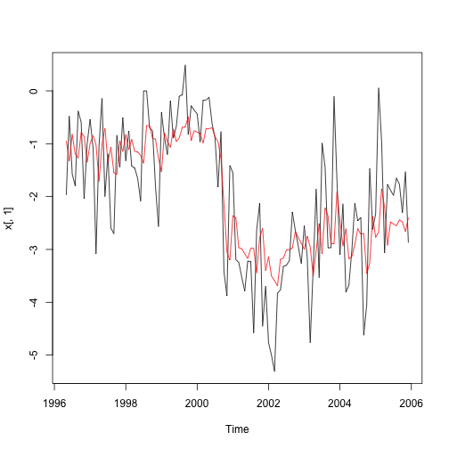 

Lets plot the impact.


```r
impact.GP <- function(model) {
	temp<- matrix(c(c(1:25), 0, rep(NA,24)), ncol=2)
	for (i in 2:25) {
		j = i-1
		temp[i,2] <- coef(model)[2]*temp[j,2]+coef(model)[3]
	}
return(ts(temp[,2]))
}  
impact.GP(model1) %>% plot(,col="orange",lwd=4)
abline(h=0)
```

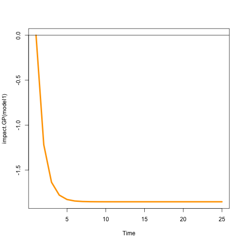 


