Regression Analysis of Time Series Demo
=======================================
#Preamble
Load some libraries.


```r
#install.packages("knitr",MSBVAR","magrittr","ggplot2","reshape2","tseries","car")
library(knitr)
library(MSBVAR)
```

```
## KernSmooth 2.23 loaded
## Copyright M. P. Wand 1997-2009
## ##
## ## MSBVAR Package v.0.9-1
## ## Build date:  Thu Oct 30 20:32:24 2014 
## ## Copyright (C) 2005-2014, Patrick T. Brandt
## ## Written by Patrick T. Brandt
## ##
## ## Support provided by the U.S. National Science Foundation
## ## (Grants SES-0351179, SES-0351205, SES-0540816, and SES-0921051)
## ##
```

```r
library(magrittr)
library(ggplot2)
```

```
## Loading required package: methods
```

```r
library(reshape2)
library(tseries)
library(car)
```

#Data
We will be analyzing the Israeli and Palesitian example again. This data can be loaded from the ***MSBVAR*** library.


```r
data(BCFdata)
```

Just like last time main time series are now in an object called `Y`:


```r
Y[1:10,]
```

```
##           I2P     P2I  JPI
##  [1,] -2.5806 -0.8364 63.3
##  [2,] -2.8823 -1.9726 66.3
##  [3,] -1.7428 -0.4788 59.7
##  [4,] -0.3978 -1.5743 63.3
##  [5,] -0.9772 -1.7973 63.8
##  [6,] -0.9365 -0.3805 60.5
##  [7,] -1.8534 -0.5937 63.1
##  [8,] -2.1137 -2.0378 63.6
##  [9,] -2.7032 -1.0073 62.5
## [10,] -1.2074 -0.5394 59.5
```

```r
is.ts(Y)
```

```
## [1] TRUE
```

```r
time(Y)
```

```
##       Jan  Feb  Mar  Apr  May  Jun  Jul  Aug  Sep  Oct  Nov  Dec
## 1996                1996 1996 1996 1996 1997 1997 1997 1997 1997
## 1997 1997 1997 1997 1997 1997 1997 1998 1998 1998 1998 1998 1998
## 1998 1998 1998 1998 1998 1998 1998 1998 1999 1999 1999 1999 1999
## 1999 1999 1999 1999 1999 1999 1999 2000 2000 2000 2000 2000 2000
## 2000 2000 2000 2000 2000 2000 2000 2000 2001 2001 2001 2001 2001
## 2001 2001 2001 2001 2001 2001 2001 2002 2002 2002 2002 2002 2002
## 2002 2002 2002 2002 2002 2002 2002 2002 2003 2003 2003 2003 2003
## 2003 2003 2003 2003 2003 2003 2003 2004 2004 2004 2004 2004 2004
## 2004 2004 2004 2004 2004 2004 2004 2004 2005 2005 2005 2005 2005
## 2005 2005 2005 2005 2005 2005 2005 2006 2006 2006 2006 2006 2006
```

```r
plot(Y)
```

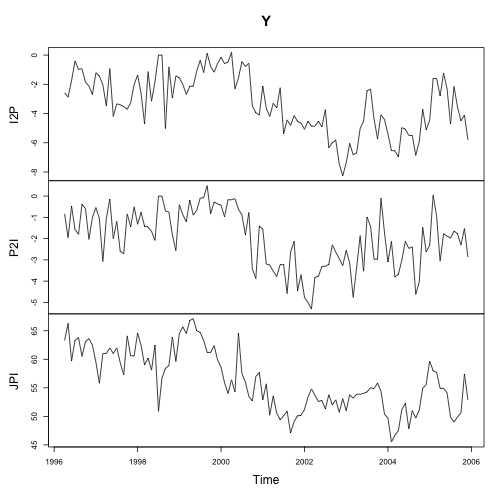 

#GGreat Plotting
Lets take a little bit of time and talk about making a nice time series plot. The plotting library ggplot2 by Hadley Wickham is very useful. It allows you to build up graphs one piece at a time, while maintining significant control of the output. 

First lets make this into a data.frame, which is what ggplot2 expects as input.


```r
test.df <- data.frame(time=seq(as.Date("1996/4/1"),as.Date("2005/12/1"), "months"), order=1:117, I2P=as.matrix(Y[,"I2P"]), P2I=as.matrix(Y[,"P2I"]))
```

There are two different syntaxes for ggplot2. The first mimics the base plot:


```r
qplot(time,I2P, data=test.df, geom="line")
```

 

The second creats a ggplot object as a seperate step to writing out the plot:


```r
p <- ggplot(data=test.df, aes(x=time,y=I2P))
p+geom_line()
```

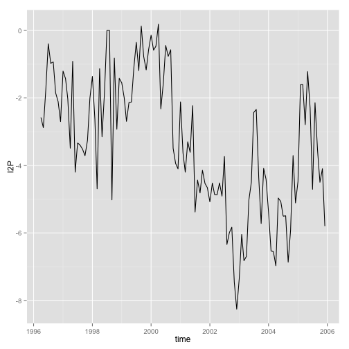 

Note that `aes` stands for aesthetics, and define the dimensions/scales of the graphs. The nice thing about gglot is that it allows you to use scales other than x and y quite easily.


```r
p+geom_line(aes(colour=P2I))
```

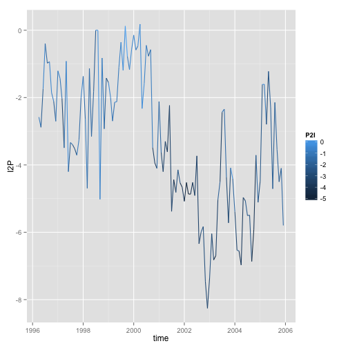 

```r
p+geom_line(aes(size=P2I))+scale_size_continuous(guide=guide_legend(reverse=TRUE))
```

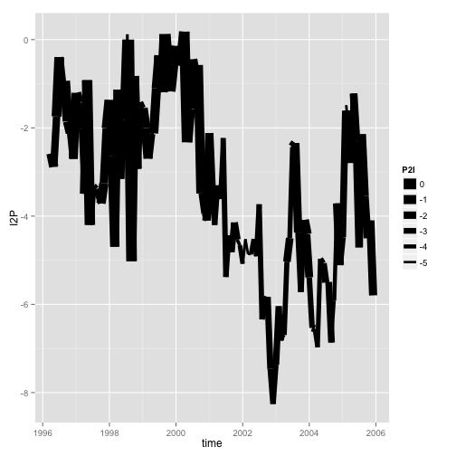 
We can also plot multiple series together. The library ggplot2 then expects the data to be in long form. Which we can do with the melt command. Remember we have:


```r
head(test.df)
```

```
##         time order     I2P     P2I
## 1 1996-04-01     1 -2.5806 -0.8364
## 2 1996-05-01     2 -2.8823 -1.9726
## 3 1996-06-01     3 -1.7428 -0.4788
## 4 1996-07-01     4 -0.3978 -1.5743
## 5 1996-08-01     5 -0.9772 -1.7973
## 6 1996-09-01     6 -0.9365 -0.3805
```

```r
dim(test.df)
```

```
## [1] 117   4
```

But we want to have a dataframe that will have columns time, variable (for I2P or P2I), and then the value (directed cooperation - conflict). Thus we will then have `dim(test.df) * 2` = 234 rows. 


```r
long.df<-melt(test.df, id.vars=c("time", "order"), measure.vars=c("I2P","P2I"), variable.name="Direction", value.name="Score")
head(long.df)
```

```
##         time order Direction   Score
## 1 1996-04-01     1       I2P -2.5806
## 2 1996-05-01     2       I2P -2.8823
## 3 1996-06-01     3       I2P -1.7428
## 4 1996-07-01     4       I2P -0.3978
## 5 1996-08-01     5       I2P -0.9772
## 6 1996-09-01     6       I2P -0.9365
```

```r
dim(long.df)
```

```
## [1] 234   4
```
We can then plot each series either together on the same plot:


```r
p <- ggplot(long.df,aes(time, Score))
p + geom_line(aes(linetype=Direction))
```

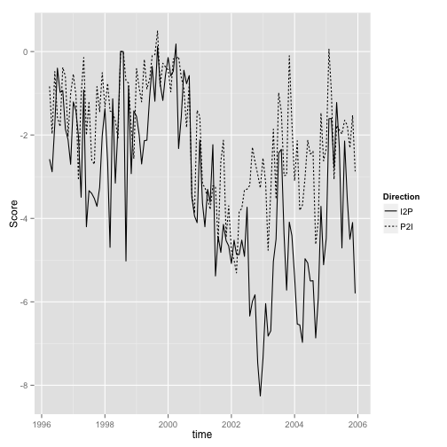 

Or on separate plots:


```r
p <- ggplot(long.df,aes(time, Score))
p + geom_line() + facet_wrap(~Direction)+theme(axis.text.x=element_text(angle=45))
```

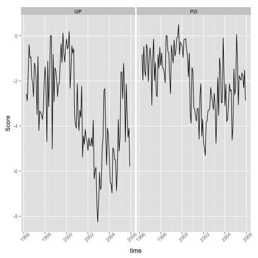 

So, facet_wrap() is just subsetting the graph by the direction variable. Also, theme() is used to control many bits and pieces of the plots, and here specifically to make sure the x-axis labels do not overlap across the two plots. 

A path through the 2-D space of the IP2/P2I data can help us look at more than one series at a time. We can go back to the wide-formatted data here.


```r
p <- ggplot(data=test.df, aes(P2I,I2P))
p + geom_path(aes(colour=order))
```

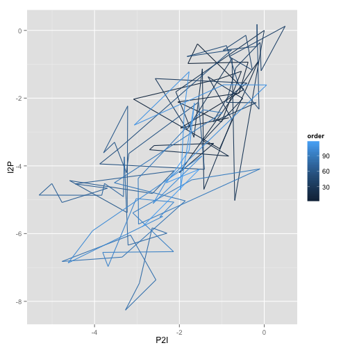 

The legend is not informative, so lets change it. 


```r
p + geom_path(aes(colour=order)) + scale_colour_continuous(name="Year", breaks = c(1, 51, 117), labels=c("1996/4","2000/6","2005/12"))
```

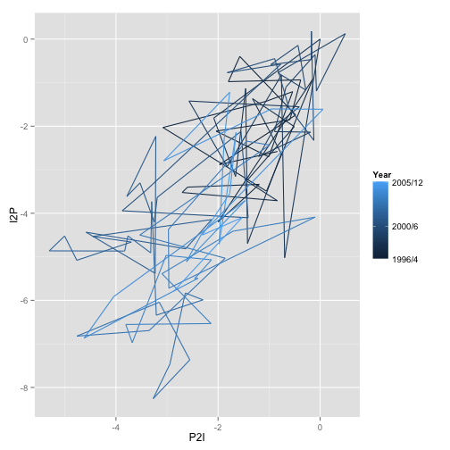 

Can change colors too:


```r
p + geom_path(aes(colour=order)) + scale_colour_continuous(name="Year", breaks = c(1, 51, 117), labels=c("1996/4","2000/6","2005/12"), low="lightgray", high="black")+theme_bw()
```

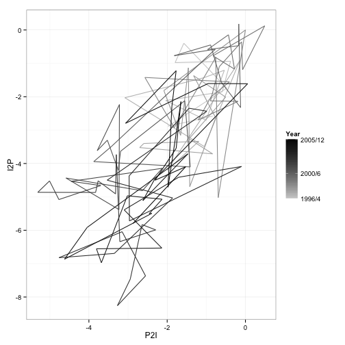 

```r
p + geom_path(aes(colour=order)) + scale_colour_continuous(name="Year", breaks = c(1, 51, 117), labels=c("1996/4","2000/6","2005/12"), low="green", high="red")+theme_bw()
```

 

#Analysis

Lets define for now that we are interested in predicting Israeli behavior towards the Palestinians, so that will be $y_{t}$ and we will use Palestinian actions towards Israeli's as our $x_{t}$. 

#Dynamics
Let loot at the dynamics of the two series individually first.


```r
par(mfrow=c(2,2))
acf(test.df[,"I2P"], main="ACF I2P")
pacf(test.df[,"I2P"], main="PACF, I2P")
acf(test.df[,"P2I"], main="ACF P2I")
pacf(test.df[,"P2I"], main="PACF P2I")
```

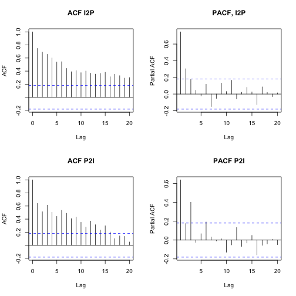 

```r
par(mfrow=c(1,1))
```

And cross-correlation.


```r
ccf(test.df[,"P2I"],test.df[,"I2P"])
```

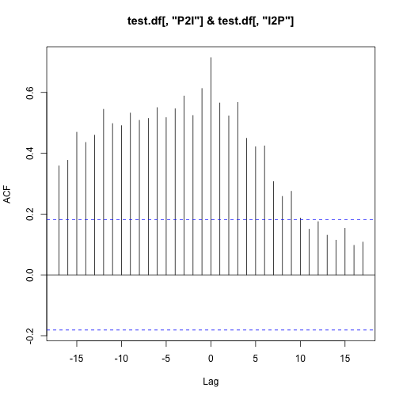 

Lets make sure we know exactly what this is.


```r
my.ccf <- function(x,y,lags) {
	corrs<-NA
	i<-1
	for (t in -lags:lags) {
		corrs[i]<- {as.matrix(ts.intersect(lag(ts(x), k=t),ts(y))) %>%
		cor(.,use="complete.obs")}[2,1]
		i<- i+1		
	}
	return(corrs)
}

cbind(ccf(test.df[,"P2I"],test.df[,"I2P"], lag.max=10, plot=FALSE)$acf,my.ccf(test.df[,"P2I"],test.df[,"I2P"],10)) %>% print() %>% plot(,xlab="ccf",ylab="my.ccf"); abline(a=0,b=1)
```

```
##         [,1]   [,2]
##  [1,] 0.4908 0.5135
##  [2,] 0.5323 0.5528
##  [3,] 0.5083 0.5257
##  [4,] 0.5146 0.5312
##  [5,] 0.5502 0.5663
##  [6,] 0.5173 0.5289
##  [7,] 0.5466 0.5553
##  [8,] 0.5883 0.5919
##  [9,] 0.5243 0.5259
## [10,] 0.6130 0.6145
## [11,] 0.7144 0.7144
## [12,] 0.5654 0.5710
## [13,] 0.5229 0.5286
## [14,] 0.5673 0.5777
## [15,] 0.4492 0.4578
## [16,] 0.4214 0.4301
## [17,] 0.4243 0.4372
## [18,] 0.3068 0.3183
## [19,] 0.2581 0.2688
## [20,] 0.2750 0.2871
## [21,] 0.1869 0.1967
```

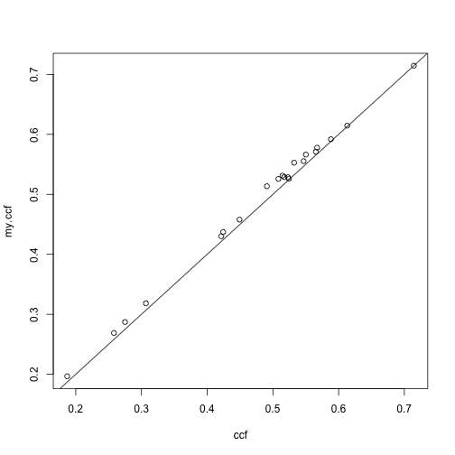 

Which is not quite right. What is going on?


```r
my.ccf2 <- function(x,y,lags) {
	x.m <- x - mean(x)
	y.m <- y- mean(y)
	vX <- sum( x.m^2)
	vY <- sum( y.m^2) 
	SxSy <- sqrt(vX*vY)
	corrs<-NA
	i<-1
	for (t in -lags:lags) {
		temp<- as.matrix(ts.intersect(lag(ts(x.m), k=t),ts(y.m)))
		corrs[i]<-sum(temp[,1]*temp[,2])/SxSy
		i<- i+1		
	}
	return(corrs)
}

cbind(ccf(test.df[,"P2I"],test.df[,"I2P"], lag.max=10, plot=FALSE)$acf,my.ccf2(test.df[,"P2I"],test.df[,"I2P"],10)) %>% print() %>% plot(,xlab="ccf",ylab="my.ccf2"); abline(a=0,b=1)
```

```
##         [,1]   [,2]
##  [1,] 0.4908 0.4908
##  [2,] 0.5323 0.5323
##  [3,] 0.5083 0.5083
##  [4,] 0.5146 0.5146
##  [5,] 0.5502 0.5502
##  [6,] 0.5173 0.5173
##  [7,] 0.5466 0.5466
##  [8,] 0.5883 0.5883
##  [9,] 0.5243 0.5243
## [10,] 0.6130 0.6130
## [11,] 0.7144 0.7144
## [12,] 0.5654 0.5654
## [13,] 0.5229 0.5229
## [14,] 0.5673 0.5673
## [15,] 0.4492 0.4492
## [16,] 0.4214 0.4214
## [17,] 0.4243 0.4243
## [18,] 0.3068 0.3068
## [19,] 0.2581 0.2581
## [20,] 0.2750 0.2750
## [21,] 0.1869 0.1869
```

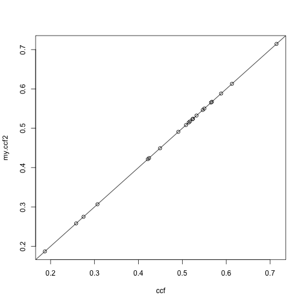 

So, for cross-correlation, the values on the left of 0 are past P2I to I2P, and the right of 0 are past P2I to I2P.


```r
ccf(test.df[,"P2I"],test.df[,"I2P"], lag.max=10, main="Cross Correlation (P2I, then I2P)")
```

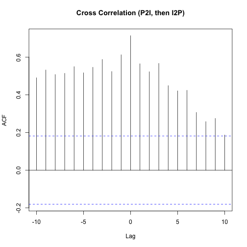 

#Stationarity

Both series look to be either stationary, but taking a while to get back to equilibrium, or non-stationary if we just focus on the plots and acfs/pacfs. A Dickey-Fuller test and augmented Dickey-Fuller test can provide a bit more information.

Remember that a Dickey-Fuller test has a null hypothesis of a unit root, and then runs a regression on the difference of y as a function of previous level of y, since a unit root would be: $y_{t}=y_{t-1}+e_{t}$ and thus, $\delta y_{t}=e_{t}$, where $e_{t}$ is white noise. However, if the series is stationary, then we have $y_{t} = \phi y_{t-1} +e_{t}$ and $\delta y_{t} = (1-\phi) y_{t-1} + e_{t}$, only when $\phi=1$ will $1-\phi = 0$. I will include a linear deterministic trend and an intercept because ***R*** does.


```r
my.dfuller.test<-function(x) {
	ts.intersect(ydiff = diff(x), y=lag(x,k=-1), t=time(x)) %>% 
		lm(ydiff~y +t ,data=.) %>%
			summary()
}
test.df[,"I2P"] %>% ts() %>% my.dfuller.test()
```

```
## 
## Call:
## lm(formula = ydiff ~ y + t, data = `ts.intersect(ydiff = diff(x), y = lag(x, k = -1), t = time(x))`)
## 
## Residuals:
##    Min     1Q Median     3Q    Max 
## -4.187 -0.707 -0.078  0.825  3.258 
## 
## Coefficients:
##             Estimate Std. Error t value Pr(>|t|)    
## (Intercept) -0.46453    0.26452   -1.76   0.0818 .  
## y           -0.35553    0.07173   -4.96  2.5e-06 ***
## t           -0.01233    0.00429   -2.87   0.0048 ** 
## ---
## Signif. codes:  0 '***' 0.001 '**' 0.01 '*' 0.05 '.' 0.1 ' ' 1
## 
## Residual standard error: 1.3 on 113 degrees of freedom
## Multiple R-squared:  0.179,	Adjusted R-squared:  0.164 
## F-statistic: 12.3 on 2 and 113 DF,  p-value: 1.46e-05
```

We can check our work with `adf.test` in the tseries library.


```r
adf.test(test.df[,"I2P"],k=0)
```

```
## Warning: p-value smaller than printed p-value
```

```
## 
## 	Augmented Dickey-Fuller Test
## 
## data:  test.df[, "I2P"]
## Dickey-Fuller = -4.956, Lag order = 0, p-value = 0.01
## alternative hypothesis: stationary
```

Remember the null: this would be interpreted as evidence against non-stationarity.  However, these tests are quite sensitive to whether there is a deterministic trend in the data and higher order autoregressive terms. So we can look at a few other specifications.


```r
my.dfuller.test2<-function(x) {
	ts.intersect(ydiff = diff(x), y=lag(x,k=-1), t=time(x)) %>% 
		lm(ydiff~y -1 ,data=.) %>%
			summary()
}
test.df[,"I2P"] %>% ts() %>% my.dfuller.test2()
```

```
## 
## Call:
## lm(formula = ydiff ~ y - 1, data = `ts.intersect(ydiff = diff(x), y = lag(x, k = -1), t = time(x))`)
## 
## Residuals:
##    Min     1Q Median     3Q    Max 
## -5.021 -0.865 -0.306  0.620  3.897 
## 
## Coefficients:
##   Estimate Std. Error t value Pr(>|t|)  
## y  -0.0596     0.0338   -1.76     0.08 .
## ---
## Signif. codes:  0 '***' 0.001 '**' 0.01 '*' 0.05 '.' 0.1 ' ' 1
## 
## Residual standard error: 1.4 on 115 degrees of freedom
## Multiple R-squared:  0.0263,	Adjusted R-squared:  0.0179 
## F-statistic: 3.11 on 1 and 115 DF,  p-value: 0.0804
```

So, when we take out the trend and intercept, which would not be there for a pure random walk, we can not reject the null of non-stationarity at the .05 level. In addition, we need to look at augmenting the test with lags of the change in $y_{t}$, since the distribution of the test is sensitive to this also.


```r
test.df[,"I2P"] %>% ts() %>%
	function(x) { 
		for (i in 1:5) {
			adf.test(x,k=i) %>% print()
		}
	}
```

```
## 
## 	Augmented Dickey-Fuller Test
## 
## data:  x
## Dickey-Fuller = -3.483, Lag order = 1, p-value = 0.04686
## alternative hypothesis: stationary
## 
## 
## 	Augmented Dickey-Fuller Test
## 
## data:  x
## Dickey-Fuller = -2.787, Lag order = 2, p-value = 0.25
## alternative hypothesis: stationary
## 
## 
## 	Augmented Dickey-Fuller Test
## 
## data:  x
## Dickey-Fuller = -2.537, Lag order = 3, p-value = 0.3538
## alternative hypothesis: stationary
## 
## 
## 	Augmented Dickey-Fuller Test
## 
## data:  x
## Dickey-Fuller = -2.586, Lag order = 4, p-value = 0.3332
## alternative hypothesis: stationary
## 
## 
## 	Augmented Dickey-Fuller Test
## 
## data:  x
## Dickey-Fuller = -2.194, Lag order = 5, p-value = 0.4961
## alternative hypothesis: stationary
```

These give different results, and there is not a good rule of thumb for choosing the number of lags.

We might also look at the KPSS test, which has trend stationarity as its null. This test uses the fact that if the series is stationarity variance of the errors should be constant. 


```r
test.df[,"I2P"] %>% ts() %>% kpss.test(, null="Trend")
```

```
## Warning: p-value smaller than printed p-value
```

```
## 
## 	KPSS Test for Trend Stationarity
## 
## data:  test.df[, "I2P"] %>% ts()
## KPSS Trend = 0.2734, Truncation lag parameter = 2, p-value = 0.01
```
So, to make this more difficult, this is evidence against the null of stationarity. 

If we look at the P2I series, we also get conflicting results.


```r
adf.test(test.df[,"P2I"],k=0)
```

```
## Warning: p-value smaller than printed p-value
```

```
## 
## 	Augmented Dickey-Fuller Test
## 
## data:  test.df[, "P2I"]
## Dickey-Fuller = -5.641, Lag order = 0, p-value = 0.01
## alternative hypothesis: stationary
```

```r
adf.test(test.df[,"P2I"],k=1)
```

```
## Warning: p-value smaller than printed p-value
```

```
## 
## 	Augmented Dickey-Fuller Test
## 
## data:  test.df[, "P2I"]
## Dickey-Fuller = -4.376, Lag order = 1, p-value = 0.01
## alternative hypothesis: stationary
```

```r
adf.test(test.df[,"P2I"],k=2)
```

```
## 
## 	Augmented Dickey-Fuller Test
## 
## data:  test.df[, "P2I"]
## Dickey-Fuller = -2.598, Lag order = 2, p-value = 0.3281
## alternative hypothesis: stationary
```

```r
kpss.test(test.df[,"P2I"], null="Trend")
```

```
## Warning: p-value smaller than printed p-value
```

```
## 
## 	KPSS Test for Trend Stationarity
## 
## data:  test.df[, "P2I"]
## KPSS Trend = 0.3199, Truncation lag parameter = 2, p-value = 0.01
```

Lets treat the data for now as if it is stationary, and then go back at the end to explore non-stationarity in a co-integration frame-work.


#Static regression
If you happend to be asleep for the semester, you might try something like this.


```r
static.reg <- lm(I2P~P2I, data=test.df)
static.reg %>% summary()
```

```
## 
## Call:
## lm(formula = I2P ~ P2I, data = test.df)
## 
## Residuals:
##    Min     1Q Median     3Q    Max 
## -3.574 -0.888  0.084  1.182  2.513 
## 
## Coefficients:
##             Estimate Std. Error t value Pr(>|t|)    
## (Intercept)  -1.1975     0.2334   -5.13  1.2e-06 ***
## P2I           1.0658     0.0973   10.95  < 2e-16 ***
## ---
## Signif. codes:  0 '***' 0.001 '**' 0.01 '*' 0.05 '.' 0.1 ' ' 1
## 
## Residual standard error: 1.42 on 115 degrees of freedom
## Multiple R-squared:  0.51,	Adjusted R-squared:  0.506 
## F-statistic:  120 on 1 and 115 DF,  p-value: <2e-16
```
What is potentially wrong with this model? Lets look at residuals.


```r
plot.resid.ts <- function(x) {
	resid.ts <- x$residuals %>% ts()
	temp <- ts.intersect(time=ts(1:length(x$residuals)),resid= resid.ts, resid.lag = lag(resid.ts, k=-1)) %>% as.data.frame()
	temp$resid.hat <- lm(resid~resid.lag, data=temp)$fitted
	temp  %>% ggplot(aes(time,resid))+geom_line()+geom_line(aes(time, resid.hat), linetype=2, color="gray")+theme_bw()
}
plot.resid.ts(static.reg)
```

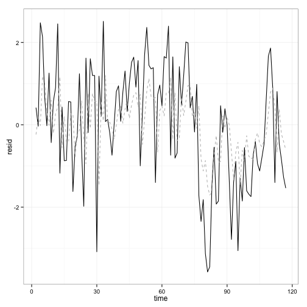 

A Durbin-Watson test can be computed since we ran a static regression.


```r
dwt(static.reg)
```

```
##  lag Autocorrelation D-W Statistic p-value
##    1          0.4719         1.045       0
##  Alternative hypothesis: rho != 0
```

Look at ACF and PACF of residuals


```r
acf(static.reg$residuals)
```

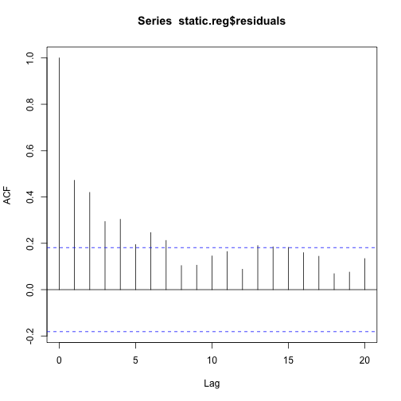 

```r
pacf(static.reg$residuals)
```

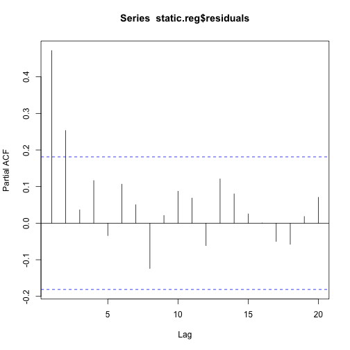 

#Leading indicator

What is we use lag of x instead? 


```r
data2 <- ts.intersect(I2P=ts(test.df$I2P), P2I=ts(test.df$P2I), P2Ilag=lag(ts(test.df$P2I), k=-1), dframe=TRUE)
Lead.reg <- lm(I2P~P2Ilag, data=data2)
Lead.reg %>% summary()
```

```
## 
## Call:
## lm(formula = I2P ~ P2Ilag, data = data2)
## 
## Residuals:
##    Min     1Q Median     3Q    Max 
## -4.051 -0.937  0.077  1.222  3.418 
## 
## Coefficients:
##             Estimate Std. Error t value Pr(>|t|)    
## (Intercept)   -1.504      0.264   -5.69  9.8e-08 ***
## P2Ilag         0.918      0.110    8.32  2.2e-13 ***
## ---
## Signif. codes:  0 '***' 0.001 '**' 0.01 '*' 0.05 '.' 0.1 ' ' 1
## 
## Residual standard error: 1.6 on 114 degrees of freedom
## Multiple R-squared:  0.378,	Adjusted R-squared:  0.372 
## F-statistic: 69.2 on 1 and 114 DF,  p-value: 2.17e-13
```

```r
plot.resid.ts(Lead.reg)
```

 

```r
dwt(Lead.reg)
```

```
##  lag Autocorrelation D-W Statistic p-value
##    1          0.3739         1.222       0
##  Alternative hypothesis: rho != 0
```

```r
acf(Lead.reg$residuals)
```

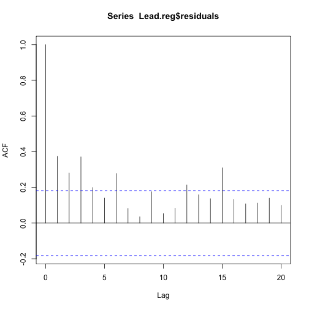 

```r
pacf(Lead.reg$residuals)
```

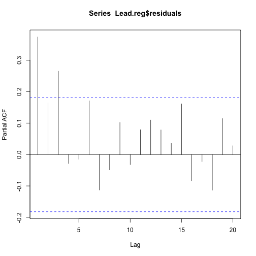 

#Dead Start model

So, we add an ar(1) component. 


```r
data3 <- ts.intersect(I2P=ts(test.df$I2P), I2Plag = lag(ts(test.df$I2P),k=-1), P2I=ts(test.df$P2I), P2Ilag=lag(ts(test.df$P2I), k=-1), dframe=TRUE)
Dead.reg <- lm(I2P~I2Plag+P2Ilag, data=data3)
Dead.reg %>% summary()
```

```
## 
## Call:
## lm(formula = I2P ~ I2Plag + P2Ilag, data = data3)
## 
## Residuals:
##    Min     1Q Median     3Q    Max 
## -4.286 -0.709  0.029  0.879  3.301 
## 
## Coefficients:
##             Estimate Std. Error t value Pr(>|t|)    
## (Intercept)  -0.7354     0.2425   -3.03    0.003 ** 
## I2Plag        0.6422     0.0878    7.32  3.9e-11 ***
## P2Ilag        0.2377     0.1303    1.82    0.071 .  
## ---
## Signif. codes:  0 '***' 0.001 '**' 0.01 '*' 0.05 '.' 0.1 ' ' 1
## 
## Residual standard error: 1.33 on 113 degrees of freedom
## Multiple R-squared:  0.578,	Adjusted R-squared:  0.57 
## F-statistic: 77.3 on 2 and 113 DF,  p-value: <2e-16
```

```r
plot.resid.ts(Dead.reg)
```

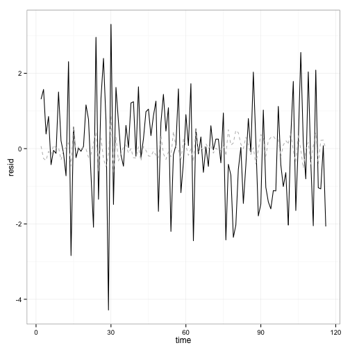 

```r
acf(Dead.reg$residuals)
```

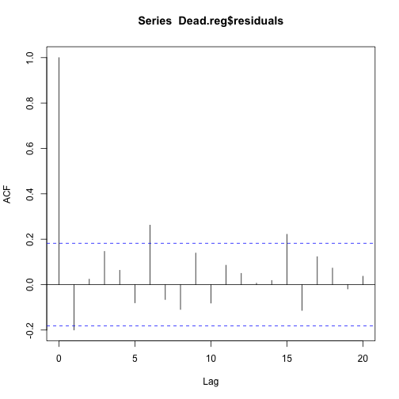 

```r
pacf(Dead.reg$residuals)
```

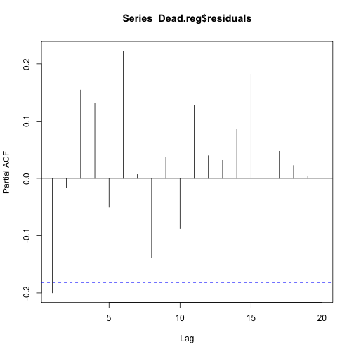 
 
Remember that `dwt()` here is not appropriate since we have a lagged dependent variable in the model. Need to move to Durbin's M-test.


```r
durbin.m <- function(x,z,maxlag) {
	#x should be model object
	#z are other variables in model$fun
	#fun to create matrix of lags
	lagmat <- function(x,maxlag) {
		embed(c(rep(NA,maxlag),x), maxlag+1)
	}
	temp1 <- lagmat(x=x$residuals,maxlag=maxlag) %>% as.data.frame()
	names(temp1)[1]<-"resid"
	for (i in 1:maxlag) {
		names(temp1)[i+1]<-paste("residlag",i,sep="")
	}
	temp <- cbind(temp1,Z)
	hypoth <- diag(maxlag+1+dim(Z)[2])
	hypoth<-hypoth[-1,]
	hypoth<-hypoth[1:maxlag,]
	lm(temp) %>% linearHypothesis(, hypothesis.matrix=hypoth, rhs=c(rep(0,maxlag)))

}
Z <- data3[,c("I2Plag","P2Ilag")]
durbin.m(Dead.reg,Z,1)
```

```
## Linear hypothesis test
## 
## Hypothesis:
## residlag1 = 0
## 
## Model 1: restricted model
## Model 2: resid ~ residlag1 + I2Plag + P2Ilag
## 
##   Res.Df RSS Df Sum of Sq    F Pr(>F)   
## 1    112 199                            
## 2    111 184  1      14.2 8.57 0.0041 **
## ---
## Signif. codes:  0 '***' 0.001 '**' 0.01 '*' 0.05 '.' 0.1 ' ' 1
```

```r
durbin.m(Dead.reg,Z,3)
```

```
## Linear hypothesis test
## 
## Hypothesis:
## residlag1 = 0
## residlag2 = 0
## residlag3 = 0
## 
## Model 1: restricted model
## Model 2: resid ~ residlag1 + residlag2 + residlag3 + I2Plag + P2Ilag
## 
##   Res.Df RSS Df Sum of Sq    F Pr(>F)   
## 1    110 194                            
## 2    107 174  3      20.1 4.12 0.0082 **
## ---
## Signif. codes:  0 '***' 0.001 '**' 0.01 '*' 0.05 '.' 0.1 ' ' 1
```

```r
durbin.m(Dead.reg,Z,5)
```

```
## Linear hypothesis test
## 
## Hypothesis:
## residlag1 = 0
## residlag2 = 0
## residlag3 = 0
## residlag4 = 0
## residlag5 = 0
## 
## Model 1: restricted model
## Model 2: resid ~ residlag1 + residlag2 + residlag3 + residlag4 + residlag5 + 
##     I2Plag + P2Ilag
## 
##   Res.Df RSS Df Sum of Sq    F Pr(>F)  
## 1    108 193                           
## 2    103 170  5      23.5 2.85  0.019 *
## ---
## Signif. codes:  0 '***' 0.001 '**' 0.01 '*' 0.05 '.' 0.1 ' ' 1
```

```r
#check with bgtest() from lmtest library
bgtest(Dead.reg,1, type="F",fill=NA)
```

```
## Error: could not find function "bgtest"
```

Not very re-assuring. However, we can calucluate the total multiplier for the data:


```r
total.mult <- function(Bs, phis) {
	#input vector of coefs on x (Bs)
	#and vector of coefs on lags of dep. var (phis)
	sum(Bs)/(1-sum(phis))
}
```


#ADL(1,1)

We can look at a model that has an impact multiplier, as well as well.


```r
adl11.reg <- lm(I2P~I2Plag+P2I+P2Ilag, data=data3)
adl11.reg %>% summary()
```

```
## 
## Call:
## lm(formula = I2P ~ I2Plag + P2I + P2Ilag, data = data3)
## 
## Residuals:
##    Min     1Q Median     3Q    Max 
## -4.184 -0.760  0.101  0.776  2.715 
## 
## Coefficients:
##             Estimate Std. Error t value Pr(>|t|)    
## (Intercept)  -0.3782     0.2174   -1.74    0.085 .  
## I2Plag        0.5406     0.0776    6.97  2.4e-10 ***
## P2I           0.6601     0.1056    6.25  7.5e-09 ***
## P2Ilag       -0.0785     0.1235   -0.64    0.526    
## ---
## Signif. codes:  0 '***' 0.001 '**' 0.01 '*' 0.05 '.' 0.1 ' ' 1
## 
## Residual standard error: 1.15 on 112 degrees of freedom
## Multiple R-squared:  0.687,	Adjusted R-squared:  0.679 
## F-statistic: 81.9 on 3 and 112 DF,  p-value: <2e-16
```

```r
plot.resid.ts(adl11.reg)
```

 

```r
acf(adl11.reg$residuals)
```

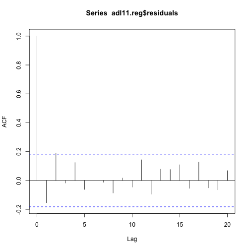 

```r
pacf(adl11.reg$residuals)
```

 

```r
Z<-data3[,c("I2Plag","P2I","P2Ilag")]
for (i in 1:5) {
	durbin.m(adl11.reg,Z,i) %>% print()
}
```

```
## Linear hypothesis test
## 
## Hypothesis:
## residlag1 = 0
## 
## Model 1: restricted model
## Model 2: resid ~ residlag1 + I2Plag + P2I + P2Ilag
## 
##   Res.Df RSS Df Sum of Sq    F Pr(>F)   
## 1    111 147                            
## 2    110 137  1        10 8.02 0.0055 **
## ---
## Signif. codes:  0 '***' 0.001 '**' 0.01 '*' 0.05 '.' 0.1 ' ' 1
## Linear hypothesis test
## 
## Hypothesis:
## residlag1 = 0
## residlag2 = 0
## 
## Model 1: restricted model
## Model 2: resid ~ residlag1 + residlag2 + I2Plag + P2I + P2Ilag
## 
##   Res.Df RSS Df Sum of Sq  F Pr(>F)  
## 1    110 147                         
## 2    108 137  2      10.2  4  0.021 *
## ---
## Signif. codes:  0 '***' 0.001 '**' 0.01 '*' 0.05 '.' 0.1 ' ' 1
## Linear hypothesis test
## 
## Hypothesis:
## residlag1 = 0
## residlag2 = 0
## residlag3 = 0
## 
## Model 1: restricted model
## Model 2: resid ~ residlag1 + residlag2 + residlag3 + I2Plag + P2I + P2Ilag
## 
##   Res.Df RSS Df Sum of Sq   F Pr(>F)  
## 1    109 143                          
## 2    106 132  3      10.9 2.9  0.039 *
## ---
## Signif. codes:  0 '***' 0.001 '**' 0.01 '*' 0.05 '.' 0.1 ' ' 1
## Linear hypothesis test
## 
## Hypothesis:
## residlag1 = 0
## residlag2 = 0
## residlag3 = 0
## residlag4 = 0
## 
## Model 1: restricted model
## Model 2: resid ~ residlag1 + residlag2 + residlag3 + residlag4 + I2Plag + 
##     P2I + P2Ilag
## 
##   Res.Df RSS Df Sum of Sq    F Pr(>F)  
## 1    108 143                           
## 2    104 131  4      11.9 2.36  0.058 .
## ---
## Signif. codes:  0 '***' 0.001 '**' 0.01 '*' 0.05 '.' 0.1 ' ' 1
## Linear hypothesis test
## 
## Hypothesis:
## residlag1 = 0
## residlag2 = 0
## residlag3 = 0
## residlag4 = 0
## residlag5 = 0
## 
## Model 1: restricted model
## Model 2: resid ~ residlag1 + residlag2 + residlag3 + residlag4 + residlag5 + 
##     I2Plag + P2I + P2Ilag
## 
##   Res.Df RSS Df Sum of Sq    F Pr(>F)  
## 1    107 143                           
## 2    102 130  5      12.4 1.94  0.094 .
## ---
## Signif. codes:  0 '***' 0.001 '**' 0.01 '*' 0.05 '.' 0.1 ' ' 1
```

```r
#check 
bgtest(adl11.reg,1, type="F", fill=NA)
```

```
## Error: could not find function "bgtest"
```

```r
total.mult(coef(adl11.reg)[3:4],coef(adl11.reg)[2])
```

```
## [1] 1.266
```

#Model Comparison
We can compare the models we fit by AIC and BIC as long as they were on the same data.


```r
#rerun static.reg without the first obs
static.reg2<-lm(I2P~P2I, data=subset(data3, is.na(I2Plag)==FALSE))
AIC(static.reg2, Lead.reg,Dead.reg, adl11.reg)
```

```
##             df   AIC
## static.reg2  3 414.8
## Lead.reg     3 442.6
## Dead.reg     4 399.6
## adl11.reg    5 366.9
```

BIC penalizes complicated models more.


```r
BIC(static.reg2, Lead.reg,Dead.reg, adl11.reg)
```

```
##             df   BIC
## static.reg2  3 423.1
## Lead.reg     3 450.9
## Dead.reg     4 410.6
## adl11.reg    5 380.7
```

Thus the ADL(1,1) here is preferred relatively to the others. This is a bit of bad news, as this means the simultaneous covariance is signficiant, and we do not know whether that should be interpreted as I2P leading to P2I, P2I leading to I2P, or both.

#Explore Co-integration
Lets take a quick look at two-step cointegration. Remeber we have ambiguous results for stationarity for each of the I2P and P2I series.


```r
adf.test(test.df[,"I2P"],k=1)
```

```
## 
## 	Augmented Dickey-Fuller Test
## 
## data:  test.df[, "I2P"]
## Dickey-Fuller = -3.483, Lag order = 1, p-value = 0.04686
## alternative hypothesis: stationary
```

```r
adf.test(test.df[,"P2I"],k=1)
```

```
## Warning: p-value smaller than printed p-value
```

```
## 
## 	Augmented Dickey-Fuller Test
## 
## data:  test.df[, "P2I"]
## Dickey-Fuller = -4.376, Lag order = 1, p-value = 0.01
## alternative hypothesis: stationary
```

```r
adf.test(test.df[,"I2P"],k=5)
```

```
## 
## 	Augmented Dickey-Fuller Test
## 
## data:  test.df[, "I2P"]
## Dickey-Fuller = -2.194, Lag order = 5, p-value = 0.4961
## alternative hypothesis: stationary
```

```r
adf.test(test.df[,"P2I"],k=5)
```

```
## 
## 	Augmented Dickey-Fuller Test
## 
## data:  test.df[, "P2I"]
## Dickey-Fuller = -1.855, Lag order = 5, p-value = 0.6367
## alternative hypothesis: stationary
```

 To look for cointegration, we would run the first stage cointegrating regression, and then check the residuals for a unit root. We have already done the first stage regression `static.reg`

 
 ```r
 adf.test(static.reg$residuals, k=1)
 ```
 
 ```
 ## Warning: p-value smaller than printed p-value
 ```
 
 ```
 ## 
 ## 	Augmented Dickey-Fuller Test
 ## 
 ## data:  static.reg$residuals
 ## Dickey-Fuller = -4.588, Lag order = 1, p-value = 0.01
 ## alternative hypothesis: stationary
 ```
 
 ```r
 adf.test(static.reg$residuals, k=5)
 ```
 
 ```
 ## 
 ## 	Augmented Dickey-Fuller Test
 ## 
 ## data:  static.reg$residuals
 ## Dickey-Fuller = -2.89, Lag order = 5, p-value = 0.207
 ## alternative hypothesis: stationary
 ```

So there is not evidence of co-integration here. 


#Explore structual break

We can look at whether there is evidence of a structural break in the mean of I2P at Sept 2000, which is time observation 54 in Y. Set up the restricted and unrestricted model.


```r
ggplot(test.df,aes(order, I2P))+geom_line()+geom_vline(xintercept=54, colour="red")
```

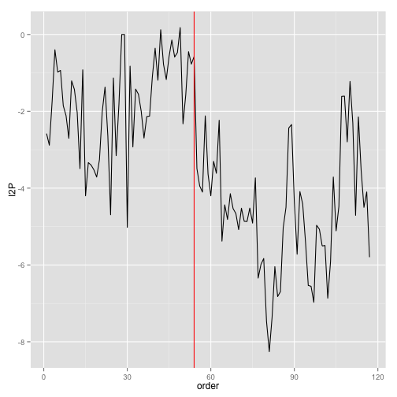 

The restricted model will simply be our ADL(1,1). The unrestricted will be separate ADL(1,1) models fit to the observations upto 54 and then after observation 54.


```r
restrict<- adl11.reg
data4 <- cbind(data3,test.df[-1,"order"])
names(data4)[5]<-"order"
unrestrict1<- lm(I2P~I2Plag + P2I + P2Ilag, data=subset(data4, order<54))
unrestrict2<- lm(I2P~I2Plag + P2I + P2Ilag, data=subset(data4, order>=54))
rss.r<-restrict$residuals^2
rss.u1<-unrestrict1$residuals^2
rss.u2<-unrestrict2$residuals^2
k<-length(coef(restrict))
n<-dim(data4)[1]
chow.stat<- ((sum(rss.r)-(sum(rss.u1)+sum(rss.u2)))/k) / ((sum(rss.u1)+sum(rss.u2))/(n-2*k))
1-pf(chow.stat, k, (n - 2*k))
```

```
## [1] 0.002574
```

So evidence of some changes. That could explain some of our problems.


